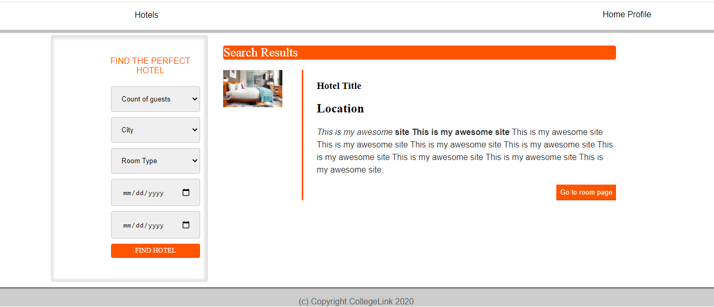

# Project Name
HotelApp

## Table of contents
* Raw HTML files
  * index.html
  * list.html
  * login.html
  * profile.html
  * register.html
* Scripts
  * app.js
* Assets
  * CSS files
  * Images

## General info
This is a website that aims to help hotels manage their reservations. It allows guests to view rooms and book a reservation online.

## Screenshots

## Technologies
* HTML
* CSS
* JavaScript
* PHP
* SQL

## To-do list:
* Build User Profile page
* Build Room Search page
* Build Room Favorite page
* Build Room Review page

## Status
Project is: _in progress_ (I'm currently working on the backend)

## Inspiration
Project inspired by : Web Development eLearning Academy by Collegelink

